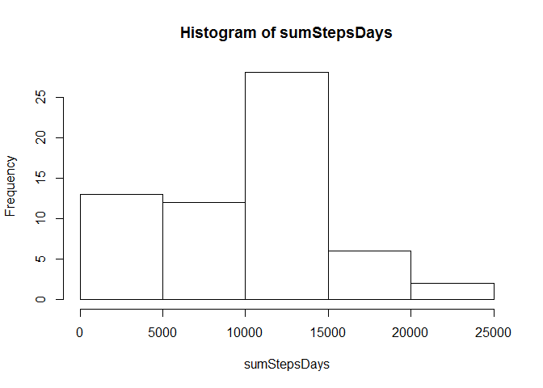
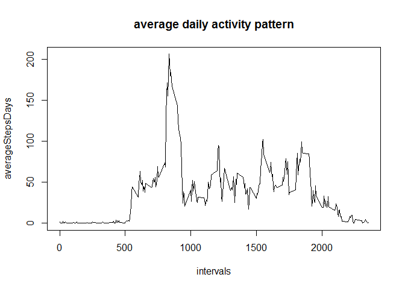
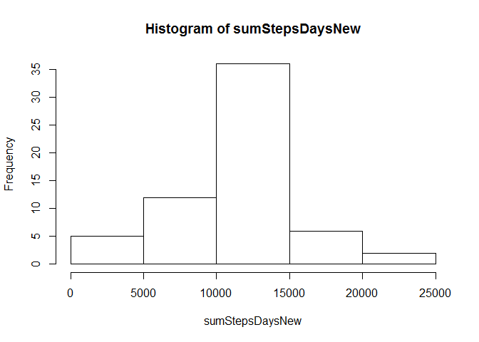
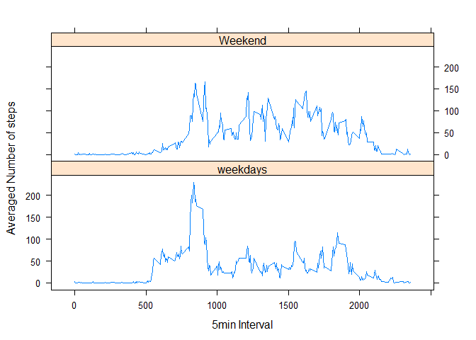

# Reproducible Research: Peer Assessment 1

## Loading and preprocessing the data

```r
data <-read.csv("./activity.csv")
data$date<-as.Date(data$date)
```

## What is mean total number of steps taken per day?
### codes are listed blow

```r
sumStepsDays<-with(data,tapply(steps,date,sum,na.rm = TRUE))
hist(sumStepsDays)
```

<!-- -->

```r
meanSteps<-mean(sumStepsDays,na.rm = TRUE)
medianSteps<-median(sumStepsDays,na.rm = TRUE)
```
mean and median of the total number of steps taken per day are 9354.2295082 (mean) and 10395(median)

## What is the average daily activity pattern?

```r
averageStepsDays<-with(data,tapply(steps,interval,mean,na.rm = TRUE))
intervals<-unique(data$interval)
plot(intervals,averageStepsDays,type = "l")
title("average daily activity pattern")
```

<!-- -->

```r
maxSteps<-which.max(averageStepsDays)
```

The No. 835 interval contains the maximum number of steps in all 5-minute interval on average across all the days in the dataset

## Imputing missing values
The total number of missing values in dataset is 2304


```r
averageStepsDays<-data.frame(averageStepsDays)
colnames(averageStepsDays)<-"Average"

FixMissing <- function(x) {
  xlabel<-as.character(as.numeric(x["interval"]))
  if(is.na(x["steps"])) {
    return(as.numeric(averageStepsDays[xlabel,"Average"])) }
  else {
    return(x["steps"])
  }
}
newData<-data
zeroNA_steps<-apply(data,1,FixMissing)
zeroNA_steps<-as.numeric(zeroNA_steps)
zeroNA_steps<-data.frame(zeroNA_steps)
newData["steps"]<-zeroNA_steps$zeroNA_steps
newData$steps<-as.numeric(newData$steps)#newData$steps<-zeroNA_steps
sumStepsDaysNew<-with(newData,tapply(steps,date,sum,na.rm = TRUE))
hist(sumStepsDaysNew)
```

<!-- -->

```r
meanStepsNew<-mean(sumStepsDaysNew,na.rm = TRUE)
medianStepsNew<-median(sumStepsDaysNew,na.rm = TRUE)
```
mean and median of the total number of steps taken per day are 1.0766189\times 10^{4} (mean) and 1.0766189\times 10^{4}(median)

## Are there differences in activity patterns between weekdays and weekends?

```r
newData<-data.frame(newData)
newData["Weekdays"]<-ifelse(weekdays(newData$date)=="Saturday" |weekdays(newData$date)=="Sunday","Weekend","weekdays")
library(lattice)
weekMean <- aggregate(steps ~ interval + Weekdays, newData, mean)
xyplot(steps ~ interval | Weekdays, weekMean, type = "l", layout 
       = c(1, 2), xlab = "5min Interval", ylab = "Averaged Number of steps")
```

<!-- -->

